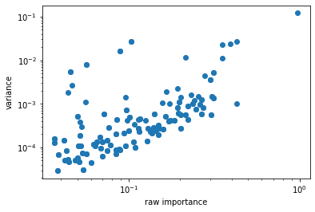

up to this point coefficients for each central specie are 4 dimensional
numpy array with indexing [environmental index, radial basis/specie
index, lambda, m]

Let's focus on only H centered environments:

.. code:: ipython3

    coefficients = coefficients[1]
    print(coefficients.shape)

.. raw:: html
    
    <embed>
    <pre>
    

        (4000, 10, 6, 11)
    

    </pre>
    </embed>
    
The first step is to perform initial scaling, as it was discussed in the
first tutorial. For this purposes there is class InitialScaler:

.. code:: ipython3

    initial_scaler = InitialScaler(mode='signal integral', individually=False)
    initial_scaler.fit(coefficients)
    coefficients = initial_scaler.transform(coefficients)

If individually is set to False this class requires fitting before
transforming the data. Otherwise fitting is not required.

Since we are going to track parity of covariants, i. e. keep even and
odd features separated, we need to split them at the begining of our
calculations:

.. code:: ipython3

    data_even_1, data_odd_1 = InitialTransformer().transform(coefficients)
    print(type(data_even_1))
    print(data_even_1.covariants_.shape)
    print("even features sizes: ", data_even_1.actual_sizes_)
    print("odd features sizes: ", data_odd_1.actual_sizes_)

.. raw:: html
    
    <embed>
    <pre>
    

        <class 'nice.nice_utilities.Data'>
        (4000, 10, 6, 11)
        even features sizes:  [10, 0, 10, 0, 10, 0]
        odd features sizes:  [0, 10, 0, 10, 0, 10]
    

    </pre>
    </embed>
    
The result is couple of Data instances which was already discussed in
the tutorial "Calculating covariants".

All spherical expansion coefficients with even l remain constant under
reflections, i. e. are even covariants, while all spherical expansion
coefficients with odd l changes sign under reflection, i. e. are odd
covariants.

PCA and purifiers blocks has two versions. One to transform single
instance of data of certain parity, and the second is for the same
transformation of both. For example:

.. code:: ipython3

    pca = IndividualLambdaPCAs(n_components=5)  #single parity version
    pca.fit(data_even_1)
    data_even_1_t = pca.transform(data_even_1)
    print(data_even_1_t.actual_sizes_)
    
    pca = IndividualLambdaPCAsBoth()  #both version
    pca.fit(data_even_1, data_odd_1)
    data_even_1_t, data_odd_1_t = pca.transform(data_even_1, data_odd_1)

.. raw:: html
    
    <embed>
    <pre>
    

        [5 0 5 0 5 0]
    

    </pre>
    </embed>
    
One common thing among PCA and purifiers blocks is num\_to\_fit
semantics. Each class has num\_to\_fit argument in the initialization,
which by default equals to '10x'. If num\_to\_fit is string of 'number
x' format it would cause corresponding class use no more than number
multiplier by number of components in case of pca, or number multiplier
by number of coefficients in linear regression in case of purifiers data
points. Data points are calculated as all entries of covariants. I. e.
for lambda = 3 for example each environment would bring (3 \* 2 + 1)
data points, since dimensionality of single covariant vector is (2 \*
lambda + 1). If num\_to\_fit is int, it would do the same using the
provided number as the upper bound for number of datapoints not
depending on the actual number of pca components or linear regression
coefficients. If total available number of data points is less than the
number specified by num\_to\_fit class would raise warning, that there
are not enough data. If num\_to\_fit is None corresponding block would
always use all available data for fitting.

This is done because the overall model is very diverse, and different
parts of the model requires very different amount of data for good
fitting. Thus, it is a good idea to do such restrictions to speed up the
process.

In case of PCA if n\_components specified in the constructor is less
than the actual number of features given during the fit step, it would
be decreased to actual number of features. But, if number of data points
is less than number of components after this possible decreasement
(which make it impossible to produce such amount of components) it would
raise ValueError with demand to provide more data for fitting.

In order to do PCA step in invariants branch there is class
InvariantsPCA, which actually differs from sklearn.decomposition.PCA
only by num\_to\_fit semantics:

.. code:: ipython3

    pca = InvariantsPCA(num_to_fit='300x')
    ar = np.random.rand(400, 10)
    pca.fit(ar)
    print(pca.transform(ar).shape)

.. raw:: html
    
    <embed>
    <pre>
    

        (400, 10)
    

    </pre>
    </embed>
    
.. raw:: html
    
    <embed>
    <pre>
    

        /home/pozdn/.local/lib/python3.6/site-packages/nice/blocks/compressors.py:218: UserWarning: Amount of provided data is less than the desired one to fit PCA. Number of components is 10, desired number of environments is 3000, actual number of environments is 400.
          self.n_components, num_fit_now, X.shape[0]))
    

    </pre>
    </embed>
    
For purifiers there are classes CovariantsPurifier,
CovariantsPurifierBoth, InvariantsPurifier, and
CovariantsIndividualPurifier. Their purpose is to transform data of
single parity, both chunks of data, invariants, and single lambda
channel respectively.

Their fit and transform methods accept list of covariants/invariants of
previous body orders along with current body order. For example: (Let's
pretend that we have already features of several body orders):

.. code:: ipython3

    purifier = CovariantsPurifier(max_take=3)
    purifier.fit([data_even_1, data_even_1], data_even_1)
    data_even_1_t = purifier.transform([data_even_1, data_even_1], data_even_1)

As it was already mentioned in the first tutorial purifiers can accept
arbitrarily sklearn shaped linear regressors, i. e. with fit and predict
methods. See tutorial "Custom regressors into purifiers" for example of
such custom regressor.

In order to do expansion with thresholding euristics it is necessary to
get information how important are particular features. One way is to
assing .importance\_ property in the Data class (setter will be done in
the next version of NICE). The other is to pass features through pca,
which would automatically asign importances:

.. code:: ipython3

    pca = IndividualLambdaPCAsBoth()
    pca.fit(data_even_1, data_odd_1)
    data_even_1, data_odd_1 = pca.transform(data_even_1, data_odd_1)

ThresholdExpansioner's fit and transform methods accept two even-odd
pair of datas. If first pair is of body order v1 and second pair is of
body order v2, result would be of body order v1 + v2:

.. code:: ipython3

    expansioner = ThresholdExpansioner(num_expand=200)
    
    expansioner.fit(data_even_1, data_odd_1, data_even_1, data_odd_1)
    data_even_2, data_odd_2 = expansioner.transform(data_even_1, data_odd_1,\
                                                    data_even_1, data_odd_1)
    print(data_even_2.actual_sizes_)
    print(data_odd_2.actual_sizes_)

.. raw:: html
    
    <embed>
    <pre>
    

        [ 70  69 165 142 176 121]
        [  0 124 112 178 140 150]
    

    </pre>
    </embed>
    
The most time during the fitting is consumed for precomputing
clebsch-gordan coefficients. Thus, in case of frequent expansioners
fitting with same lambda\_max, it is a good idea to precompute
clebsch-gordan coefficients once, and after that just feed expansioners
with them:

.. code:: ipython3

    clebsch = nice.clebsch_gordan.ClebschGordan(5)  # 5 is lamba max
    
    expansioner = ThresholdExpansioner(num_expand=200)
    expansioner.fit(data_even_1,
                    data_odd_1,
                    data_even_1,
                    data_odd_1,
                    clebsch_gordan=clebsch)

It might be usefull to investigate how actually usefull is thresholding
heuristic in practice. For this purpose it is possible to get "raw
importances" for output features which are multiplication of importances
of input features which were used in Clebsch-Gordan iteration. In other
words it is the criterion for selection itself.

Let's plot scatter plot which would show how selection criterion
correlates with variance of output features for example. We will use
invariants for simplicity:

.. code:: ipython3

    expansioner = ThresholdExpansioner(num_expand=200, mode='invariants')
    expansioner.fit(data_even_1,
                    data_odd_1,
                    data_even_1,
                    data_odd_1,
                    clebsch_gordan=clebsch)
    invariants_even, _ = expansioner.transform(data_even_1, data_odd_1,\
                                                    data_even_1, data_odd_1)
    
    print(invariants_even.shape)
    
    variances = np.mean(((invariants_even - np.mean(invariants_even, axis=0))**2),
                        axis=0)
    raw_importances = expansioner.new_even_raw_importances_
    
    plt.plot(np.sqrt(raw_importances), variances, 'o')
    plt.xscale('log')
    plt.yscale('log')
    plt.xlabel('raw importance')
    plt.ylabel('variance')

.. raw:: html
    
    <embed>
    <pre>
    

        (4000, 200)
    

    </pre>
    </embed>
    
.. raw:: html
    
    <embed>
    <pre>
    

        Text(0, 0.5, 'variance')
    

    </pre>
    </embed>
    

There is some correlation. Thus, tresholding heuristic works. Getters
for raw importances might be inserted in next version of NICE.

Standard block has the same input to fit and transform methods as
TresholdExpansioner if it doesn't contain purifers:

.. code:: ipython3

    block = StandardBlock(ThresholdExpansioner(num_expand=200), None,
                          IndividualLambdaPCAsBoth(n_components=10))
    block.fit(data_even_1, data_odd_1, data_even_1, data_odd_1)
    data_even_2, data_odd_2, invariants_even = block.transform(data_even_1, data_odd_1,\
                                                    data_even_1, data_odd_1)
    print(data_even_2.actual_sizes_)
    print(invariants_even)

.. raw:: html
    
    <embed>
    <pre>
    

        [10 10 10 10 10 10]
        None
    

    </pre>
    </embed>
    
In this case invariants branch was None, and thus it returned None for
invariants. This behavior is opposite to StandardSequence one, since it
always returns invariants. If invariants branch of some block would be
None it would return [:, :, 0, 0] part of covariants.

If block contains invariants purifier, than old\_even\_invariants should
be specified in fit and transform methods. If block contains covariants
purifier, than old\_even\_covariants and old\_odd\_covariants should be
specified.

old\_even\_invariants should be list of 2 dimensional numpy arrays with
previous invariants, old\_even\_covariants and old\_odd\_covariants
should be lists with Data instances.

.. code:: ipython3

    block = StandardBlock(ThresholdExpansioner(num_expand=200),
                          CovariantsPurifierBoth(max_take=10), None,
                          ThresholdExpansioner(num_expand=200, mode='invariants'),
                          InvariantsPurifier(max_take=10), None)
    
    block.fit(
        data_even_2,
        data_odd_2,
        data_even_1,
        data_odd_1,
        old_even_invariants=[data_even_1.get_invariants()
                             ],  # returns [:, :, 0, 0] slice which is invariants
        old_even_covariants=[data_even_1],
        old_odd_covariants=[data_odd_1])
    
    data_even_3, data_odd_3, invariants_even_3 = block.transform(
        data_even_2,
        data_odd_2,
        data_even_1,
        data_odd_1,
        old_even_invariants=[data_even_1.get_invariants()
                             ],  # returns [:, :, 0, 0] slice which is invariants
        old_even_covariants=[data_even_1],
        old_odd_covariants=[data_odd_1])

If block contains purifiers, but fit or transform methods are called
without providing necessary data it would raise ValueError.

One another usefull method is get\_intermediate\_shapes as in
StandardSequence:

.. code:: ipython3

    for key, value in block.get_intermediate_shapes().items(
    ):  # it is a dictionary
        print(key, value)

.. raw:: html
    
    <embed>
    <pre>
    

        after covariants expansioner [[33, 89, 125, 140, 141, 123], [28, 84, 123, 143, 143, 125]]
        after covariants purifier [[33, 89, 125, 140, 141, 123], [28, 84, 123, 143, 143, 125]]
        after invariants expansioner 200
        after invariants purifier 200
    

    </pre>
    </embed>
    
StandardSequence was already discussed in first tutorial "Constructing
machine learning potential"

Now let's go to 1024 body order!

.. code:: ipython3

    data_even_now, data_odd_now = data_even_1, data_odd_1
    
    for _ in tqdm.tqdm(range(10)):
        pca = IndividualLambdaPCAsBoth(10)
        pca.fit(data_even_now, data_odd_now)
        data_even_now, data_odd_now = pca.transform(data_even_now, data_odd_now)
        expansioner = ThresholdExpansioner(50)
        expansioner.fit(data_even_now,
                        data_odd_now,
                        data_even_now,
                        data_odd_now,
                        clebsch_gordan=clebsch)
        data_even_now, data_odd_now = expansioner.transform(
            data_even_now, data_odd_now, data_even_now, data_odd_now)
    
        # very high body order cause numerical instabilities,
        # and, thus, there is need to normalize data
        for lambd in range(6):
            size = data_even_now.actual_sizes_[lambd]
            if (size > 0):
                even_factor = np.sqrt(
                    np.mean(data_even_now.covariants_[:, :size, lambd]**2))
                if (even_factor > 1e-15):  #catch exact zeros
                    data_even_now.covariants_[:, :size, lambd] /= even_factor
            size = data_odd_now.actual_sizes_[lambd]
            if (size > 0):
                odd_factor = np.sqrt(
                    np.mean(data_odd_now.covariants_[:, :size, lambd]**2))
                if (odd_factor > 1e-15):  #catch exact zeros
                    data_odd_now.covariants_[:, :size, lambd] /= odd_factor

.. raw:: html
    
    <embed>
    <pre>
    

        100%|██████████| 10/10 [00:06<00:00,  1.62it/s]
    

    </pre>
    </embed>
    
.. code:: ipython3

    print(data_even_now.covariants_.shape)
    print(data_even_now.actual_sizes_)
    print(data_odd_now.actual_sizes_)

.. raw:: html
    
    <embed>
    <pre>
    

        (4000, 28, 6, 11)
        [ 7 19 25 28 28 25]
        [ 8 18 24 26 28 26]
    

    </pre>
    </embed>
    
Done!
